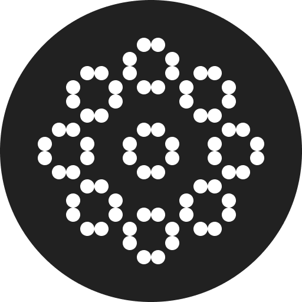
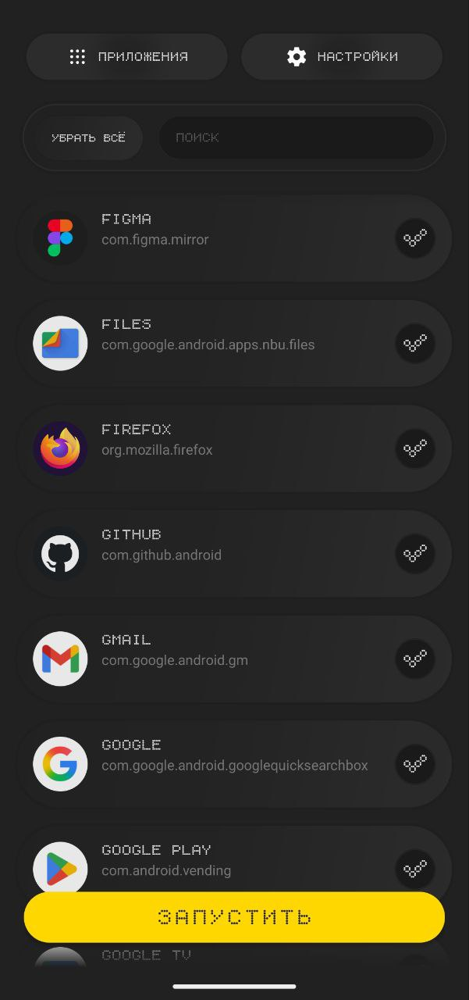
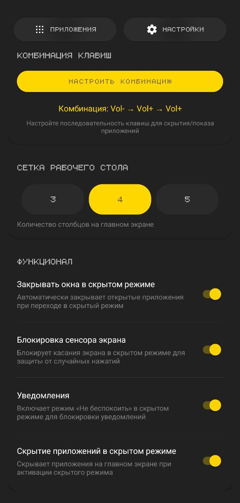
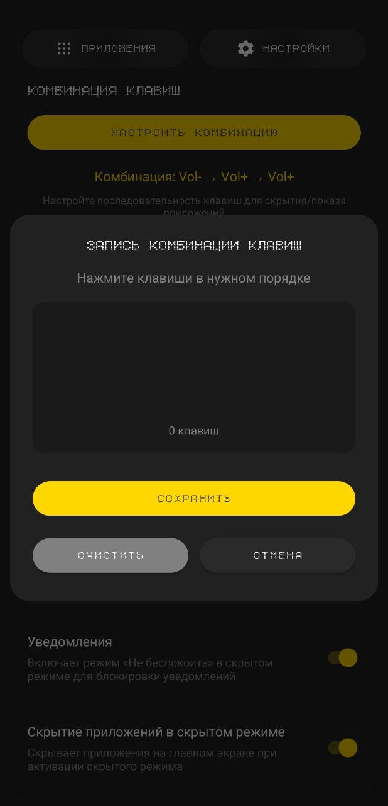
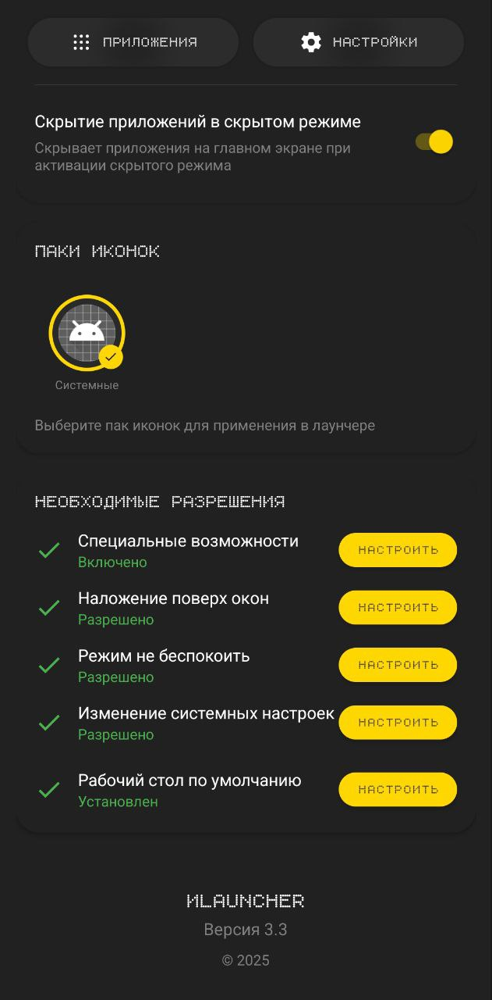

#  BИLauncher

<br clear="left"/>

[](https://github.com/Niceman228/Better-Launcher/releases)
[](#системные-требования)
[](LICENSE)

**BИLauncher** — Android-лаунчер для кнопочных телефонов и устройств с физическими клавишами, доработанный под **Qin F22** (MediaTek MT6739). Форк проекта [ИLauncher](https://github.com/Linkolnn/-Launcher) от [Linkolnn](https://github.com/Linkolnn).

## Возможности

Базовый функционал, унаследованный от оригинального ИLauncher:

- **Скрытый режим** — комбинация физических клавиш мгновенно скрывает выбранные приложения, блокирует сенсор, закрывает открытые окна, включает «Не беспокоить» и запрещает скриншоты;
- **Кастомные комбинации клавиш** — запись любой последовательности (цифры, громкость, навигация);
- **Кнопочный режим** — сетки 3×3–4×5, полная D-pad навигация, постраничное меню приложений;
- **Персонализация** — паки иконок, настройка сетки, скрытие приложений, тёмная тема с жёлтыми акцентами;
- **Главный экран** — виджет часов, drag-and-drop иконок, поиск по приложениям.

## Что улучшено в этом форке

### Производительность на слабом железе

Меню приложений на MT6739 (4× Cortex-A53 1.5 ГГц) открывалось с задержкой до секунды. Замеры `dumpsys gfxinfo` на Qin F22:

| Метрика | Оригинал | BИLauncher 5.0 |
|---|---|---|
| p90 кадра | 350 мс | **36 мс** |
| p95 кадра | 650 мс | **113 мс** |
| Janky frames | 78% | **~40%** |
| Открытие шторки | пустая, иконки с задержкой | **мгновенно, с иконками в первом кадре** |

За счёт чего:

- постоянный каталог приложений — один скан PackageManager после старта, список переживает перезапуск;
- двухуровневый кэш иконок (память + диск), растеризация сразу в размер сетки, прогрев при старте;
- синхронная публикация тёплого snapshot — шторка рисуется без IO-круга;
- максимум 2 параллельные загрузки иконок, объединение одинаковых запросов;
- запуск приложений по сохранённому ComponentName вместо запроса launch-intent при каждом bind;
- Baseline Profile для старта и открытия меню.

### Стабильность

- Скрытие/показ шторки не зависят от анимационных колбэков — на прошивках MTK они теряются, из-за чего прозрачное окно диалога навсегда перехватывало все нажатия. Исправлено с самовосстановлением состояния;
- переработаны скрытый режим и Direct Boot;
- исправлено задвоение селектора при D-pad навигации.

### Новые функции

- Кнопки вызова и контактов на главном экране в кнопочном режиме;
- отключение Wi-Fi, Bluetooth и мобильных данных в скрытом режиме (targetSdk 28 ради легаси-API радио — приложение ставится локально, ограничения Play Store не применимы);
- переиспользуемый Shizuku UserService.

## Скриншоты

<table>
  <tr>
    <td></td>
    <td></td>
    <td></td>
    <td></td>
  </tr>
</table>

## Установка

1. Скачайте APK из [Releases](https://github.com/Niceman228/Better-Launcher/releases);
2. разрешите установку из неизвестных источников;
3. установите, нажмите Home и выберите BИLauncher по умолчанию;
4. выдайте запрошенные разрешения (специальные возможности, наложение поверх окон, «Не беспокоить»).

Установка при системных ограничениях (Shizuku, ADB): [SHIZUKU_GUIDE.md](SHIZUKU_GUIDE.md)

## Сборка

```bash
git clone https://github.com/Niceman228/Better-Launcher.git
cd Better-Launcher
./gradlew assembleRelease
# APK: app/build/outputs/apk/release/BILauncher-release.apk
```

## Системные требования

- Android 8.0 (API 26) и выше;
- оптимизировано под слабые устройства (Qin F22, MT6739, 480×640);
- работает и на обычных сенсорных смартфонах.

## Лицензия

MIT — см. [LICENSE](LICENSE).

Оригинальный проект: [Linkolnn/-Launcher](https://github.com/Linkolnn/-Launcher) © [Linkolnn](https://github.com/Linkolnn)
